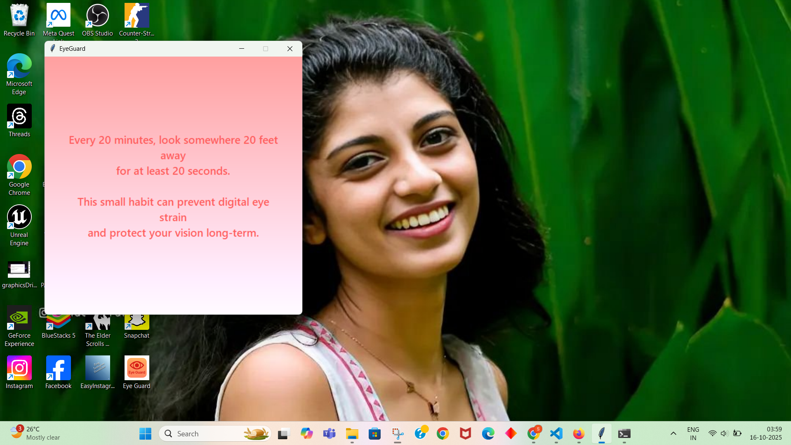

# Ensure that you will never have to wear spectacles or contact lenses in your life to cure your eyesight problem

This title is not click bait or misleading because the technique explained here do honestly completely eliminate the major cause or reason why people end up having to wear spectacles(glasses) or contact lenses at some point in their lives as a remedy for their newly found eyesight problem.

While using computers, at least during every twenty minutes, you need to strictly take your eyes off the screen and look somwhere at least 20 feet away for atleast 20 sec. 

**Download the app that persuades you to do this, from this [GumRoad Link](https://sreehari083.gumroad.com/l/lcbjw)** 

[](https://sreehari1994.github.io/eye_guard/assets/readmeVideo.mp4 "Click on the image above to watch the demo video showing start of the app")


Or read on if you want more control over the working of the application.

The rest of this section is also available as a medium article linked [here](https://medium.com/@sreehari.mras/ensure-that-you-will-never-have-to-wear-spectacles-or-contact-lenses-in-your-life-to-cure-your-a9cd3f07207a)

First of all, it is a major misconception that excessively prolonged use of computers or mobile phones results in major eyesight problems or eye sickness because the light rays emitted from the screens of these devices causes harm or damage to our eyes. While rays emitted from modern day computers and mobile phone screens are not healthy and might cause short or long lasting problems to our eyes, the predominant reason why people who sit in front of a computer screen for most of their day everyday, end up wearing specs or contact lenses is because of the fact that while using computers or mobile phones, they are unknowingly staring or looking at a particular point or thing for insanely long periods without any breaks.

Speaking from a non medical perspective or as a person who has no formal education as a medical practitioner so as to offer a reliable explanation of the workings of human eyes, this happens because there is a particular muscle in each of our eyes which expands and contracts (similar to how the muscles in our hands and legs works to help us move) to make the lens in our eyes focus correctly at a point that we are looking. So consequently repeatedly staring at something without looking elsewhere, overtime in most individuals will result in these eye muscles losing their ability to focus correctly at a point which ultimately results in the problem of us either not being able to see objects which are near to us or far away from us without the help of corrective glasses or lenses.

So the best remedy against this problem happening to our eyes, as suggested by eye doctors themselves is to take a break from our phone or computer screens every twenty minutes where during this break time, we remember to repeatedly blink our eyes a few times to ensure proper passage of eye fluid over the eyes to prevent dry eyes and then most importantly we look or stare at a far away object at least 20 feet away, preferably out of the windows of our room.

This very simple step is not as easy to follow as you might think. In fact 9 out of ten times you will fail to do this, because be it entertainment in the form of watching favorite movies or playing games or while working, often we will find ourselves glued to our phone or laptop screen where it will mostly be well over 1hour at a stretch before we remember of our need for a break. If only an alarm or alert sound happened on our phones or computers every twenty minutes reminding us to look far away and then surely our eyes would be saved.

I had tried in the past to develop an android app that does exactly this by giving out alarm sounds every twenty minutes, but despite my best efforts, I couldn’t get it to bypass android OS shutting down my app’s process running in background for saving battery or some other reasons. But fortunately, I have the most perfect solution for PC’s and laptops with any Operating Systems in the form of a Python program that always runs in background unless forcefully stopped and gives out an alarm sound in the form of a voice message during every twenty minutes twenty seconds or any interval chosen by you for the sole purpose of reminding you to take your eyes off your computer screen for the break and then after break time is over, also reminding you that you had sufficient break time and is now free to resume your work.

In order for this to work, you need to first get Python programming language installed on your system and its path added to system environment variables by following the relevant instructions on the respective websites on the Google search page. Then you need to simple clone this GitHub repo(click here) to your system. Install playsound Python library for playing the alarm audio files by running pip install playsound on the command prompt. Now you only need to open the folder having all the code files and audio files and then open command prompt to type in the command

```
python eyeguard.py
```

And then immediately you will hear a woman saying “Don’t forget to blink during the breaks”. After twenty minutes, you will hear “Its been 20 minutes, kindly look at somewhere 20 feet away for next 20 seconds” which will be followed twenty second later with the voice message “You can now resume your work”. If you wish to customize these voice messages by making the woman say in English whatever you wish to hear as alert message reminding you to break, you can do that by first installing text to audio python library gtts by running the command- pip install gtts and then modifying the eyeguard_audio_creator.py file by replacing mytext1, mytext2,mytext3 strings with your choice for the alert messages and then running the eyeguard_audio_creator.py python file to generate and save the three audio files of alarm, resume and greeting.mp3.

Now you can also decide at what time, you wish for the Python program to remind you to take a break and can also decide how long you wish for the break time to be, or in other words you can also change both the twenty minutes gap between breaks as well as the break time of 20 sec as per your needs or preference. This is done with the help of command line arguments passed to the eyeguard.py python program at the command prompt. You are welcome to provide two integers separated by spaces after the program name as your choice for interval and break times.

```
python eyeguard.py interval_time break_time
```

If you provide only the first value then that will be taken as the time between the breaks with the minimum being two minutes. i.e even if you type the command as python eyeguard.py 1 the progarm will still sound the alram during every two minutes only. The second value decides how long the break duration should be, with the minimum value being 20 sec. So if you run

```
python eyeguard.py 10
```

A voice message will remind you to take a break during every ten minutes with each break being of twenty seconds duration. And if you run

```
python eyeguard.py 3 30
```

A voice message will remind you to take a break during every three minutes with each break being of thirty seconds duration. And if you simply run python eyeguard.py as you did first, the program will default to the 20 minutes interval and 20 sec break settings. On some versions of Windows Operating systems, it is also possible to copy the eyeguard.py file(with paths to audio files correctly changed) to the OnStartup or something like that Folder so as to ensure that every time you start your system, this Python program begins its run in the background without you manually starting it on the command prompt.

As you keep on using this software or program, there will be many moments where you are made to think of how long 20 seconds feel like, which is a tight slap to our most common complaint of us not getting enough time in a day or our life to do things that we want to do.